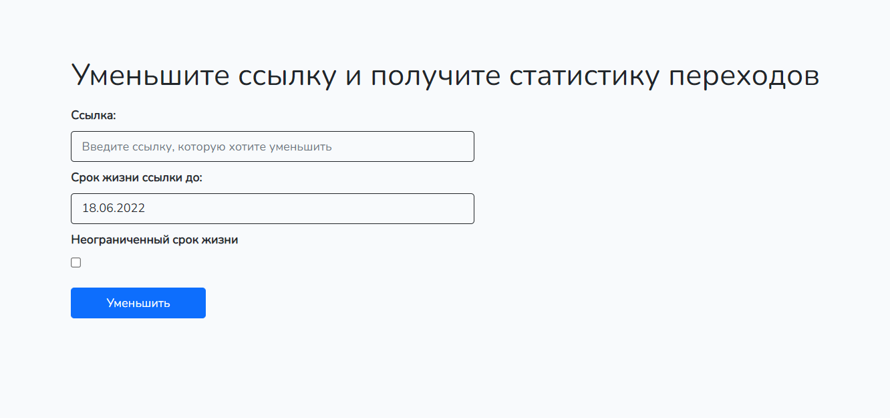
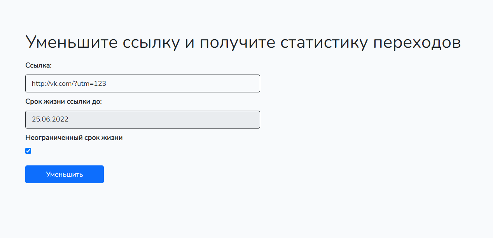
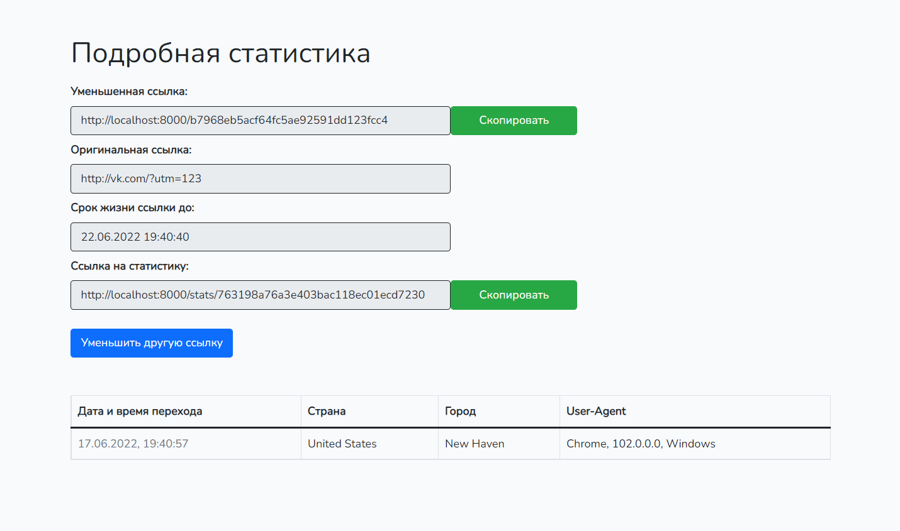

## Тестовое задание для соискателя на позицию php-разработчика (Laravel)

### Товары с максимальной ценой  

Запрос: `select * from items i1 left join items i2 on i1.category_id = i2.category_id and i1.price < i2.price where i2.price is null;`

### Пользователи  

Запрос 1: `select year(birthdate) as year, count(gender = 'M' or null) as M, count(gender = 'F' or null) as F from users u group by year;`
Запрос 2: `select * from users u left join users_banned b on u.id = b.user_id where user_id is null;`

### Сокращатель ссылок

1. Установить и запустить [Docker](https://hub.docker.com/signup?redirectTo=/subscription%3Fplan%3Dfree)

2. Клонировать проект из репозитория командой `git clone https://github.com/Maxmarok/test`, после перейти в директорию `test`

3. Выполнить команды из списка по порядку:
  - `cp .env.example .env` (`copy .env.example .env` для Windows) - копируем данные для подключения
  - `docker-compose build app` - собираем образ
  - `docker-compose up -d` - запускаем среду
  - `docker-compose exec app composer install` - устанавливаем пакеты
  - `docker-compose exec app php artisan key:generate` - генерируем ключ
  - `docker-compose exec app php artisan migrate:fresh` - перезапускаем миграции (убедитесь, что в база пустая)
  - `docker-compose exec app php artisan test` - прогоняем unit-тесты (опционально)
  - `docker-compose run --rm npm install && docker-compose run --rm npm run prod` - компилим фронтенд часть

4. Открыть проект по ссылке в браузере `http://localhost:8000`

5. В открытой странице ввести искомую ссылку, которую нужно уменьшить
  - *Указать срок жизни ссылки или выбрать опцию "Неограниченный срок жизни" (опционально)*

6. Нажать кнопку "Уменьшить"

7. Если все данные указаны верно, то вы попадете на страницу "Статистика" и вам будут доступны ссылки и таблица статистики переходов по вашей сокращенной ссылке

8. При переходе по уменьшенной ссылке в таблицу добавляется строчка с данными пользователя, который перешел по вашей ссылке

9. Ссылка на статистику нужно сохранить, чтобы получить данные в любое время

10. Как только проект наскучит, его можно выключить командой `docker-compose down`
